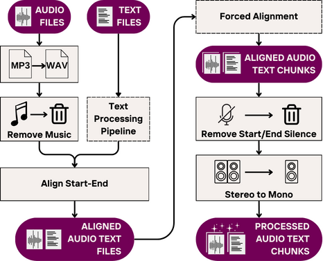
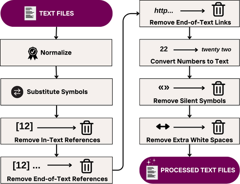

# Mana Speech Dataset Generator

This repository provides a **modular, open-source pipeline** for converting raw audio + text pairs into high-quality, clean, and aligned speech datasets.
The pipeline is designed to work even when audio and text are not perfectly aligned — making it suitable for low-resource or noisy real-world settings.

---

## ⚙️ What’s Included in the Pipeline?

* 🔊 **Audio Preprocessing**

  * Format conversion (e.g., MP3 to WAV)
  * Background music removal using [Spleeter](https://github.com/deezer/spleeter)
  * Stereo-to-mono conversion
  * Silence trimming (after alignment)

* ✏️ **Text Cleaning and Normalization**

  * Unicode normalization and punctuation cleanup
  * Removal of references, URLs, and metadata
  * Spoken-form conversion for numbers (e.g., 2024 → "two thousand twenty-four")

* ⏱ **Start-End Alignment**

  * Trims audio boundaries to match transcript using ASR-assisted matching

* 📌 **Forced Alignment**

  * Segments audio into 2–12s chunks and aligns them with corresponding text spans
  * Uses character error rate (CER) thresholds to ensure alignment quality
  * Based on [Mana Forced Aligner](https://github.com/MahtaFetrat/Mana-Forced-Aligner)

---

## 🧩 Pipeline Overview

<div align="center">

<table style="border: none; border-collapse: collapse; margin: 0 auto;">
  <tr style="border: none;">
    <td style="border: none; padding: 0 10px; text-align: center;">
      
      <p style="margin-top: 5px;">Audio and text processing pipeline</p>
    </td>
    <td style="border: none; padding: 0 10px; text-align: center;">
      
      <p style="margin-top: 5px;">Detailed text preprocessing steps</p>
    </td>
  </tr>
</table>

</div>

---

## 🔗 Forced Alignment: Robust Matching of Audio and Text

Aligning long audio files with transcripts can be challenging — especially when the content isn’t an exact match.

This pipeline includes a built-in **forced alignment module** that:

* Segments audio using silence detection
* Uses multiple ASR outputs to match audio chunks to reference text
* Accepts matches based on CER thresholds — even with small mismatches

➡️ Learn more and use it independently:
👉 [Mana Forced Aligner](https://github.com/MahtaFetrat/Mana-Forced-Aligner)

---

## 📦 Datasets Created with This Pipeline

| Dataset Name      | Language | Size     | License | Links                                                                                                                                                                                                                                                                                                                     |
| ----------------- | -------- | -------- | ------- | ------------------------------------------------------------------------------------------------------------------------------------------------------------------------------------------------------------------------------------------------------------------------------------------------------------------------- |
| **ManaTTS**       | Persian  | 102+ hrs | CC-0    | [](https://huggingface.co/datasets/MahtaFetrat/Mana-TTS) [](https://github.com/MahtaFetrat/ManaTTS-Persian-Speech-Dataset) |
| **Quran-Persian** | Persian  | 20+ hrs  | CC-0    | [](https://huggingface.co/datasets/MahtaFetrat/Quran-Persian)                                                                                                                                                                                  |

Feel free to reach out if you'd like yours featured.

---

## 🚀 Getting Started

[](https://colab.research.google.com/drive/1fWTy4IH2tSuOLrLSD8E8LMaUlI_Gnf-e?usp=sharing)

You can run the pipeline using the online **[Google Colab notebook](https://colab.research.google.com/drive/1fWTy4IH2tSuOLrLSD8E8LMaUlI_Gnf-e?usp=sharing)**
or offline using the provided notebook: [`Mata_Dataset-Generation.ipynb`](Mata_Dataset-Generation.ipynb)

---

## 📚 Citation

If you use this project in your work, please cite the corresponding paper:

```bibtex
@inproceedings{qharabagh-etal-2025-manatts,
    title = "{M}ana{TTS} {P}ersian: a recipe for creating {TTS} datasets for lower resource languages",
    author = "Qharabagh, Mahta Fetrat  and Dehghanian, Zahra  and Rabiee, Hamid R.",
    booktitle = "Proceedings of the 2025 Conference of the Nations of the Americas Chapter of the Association for Computational Linguistics: Human Language Technologies (Volume 1: Long Papers)",
    month = apr,
    year = "2025",
    address = "Albuquerque, New Mexico",
    publisher = "Association for Computational Linguistics",
    url = "https://aclanthology.org/2025.naacl-long.464/",
    pages = "9177--9206",
}
```

---

## 🤝 Contributions

Contributions are welcome! Please open an issue to discuss ideas or submit a pull request.

---

## 🔗 Additional Links

* [ManaTTS Paper](https://aclanthology.org/2025.naacl-long.464/)
* [Mana Forced Aligner](https://github.com/MahtaFetrat/Mana-Forced-Aligner)
